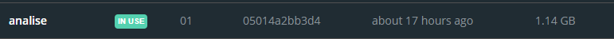
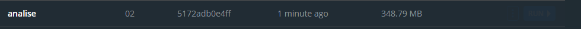
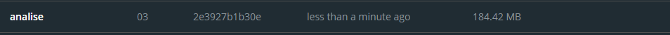
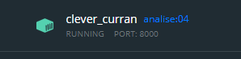
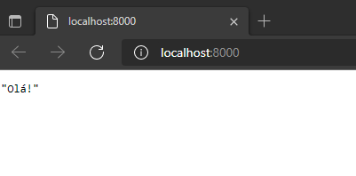

# Resposta Backend - Q1 

Bem vindo leitor. Neste documento você terá acesso a toda documentação e o passo a passo para realização dessa questão.

# Tabela de conteúdo - Geral

1. [ Questão pedida. ](#desc)
2. [ Solução. ](#usage)

---

<a name="desc"></a>
<h2> Backend - Q1 </h2>

Valor: 1.5 pt

Corrija e otimize o Dockerfile existente no diretório.
O projeto inicial buildado pesará, aproximadamente, 1.1GB.

🏋️ Reduza o peso geral da imagem o máximo possível.  
⏰ Reduza o tempo de build o máximo que conseguir. Considere que o código pode mudar.

Crie uma versão "Dockerfile.otimizado" contendo suas alterações e mantenha o original.

Para executar o build, utilize o script bash ```docker-build.bash``` disponibilizado:

```bash
bash docker-build.bash -t q1:dev .
```

O script irá gerar um JSON contendo os tempos de build em cada etapa.
Compartilhe a saída JSON do bash executado, tal como o exemplo abaixo:

```json
[
  {
    "time": 1632846937,
    "step": 0,
    "cmd": "START"
  },
  {
    "time": 1632846958,
    "step": 1,
    "cmd": "FROM python:latest"
  },
  {...}
]
```

Descreva abaixo, em poucas linhas, o que você fez e por que o fez para melhorar o
Dockerfile e colocar o projeto para funcionar.

---

<a name="usage"></a>
<h2>Solução</h2>

<h3> Tabela de Solução</h3>

1. [ Análise da imagem passada. ](#1)
2. [ Solução da diminuição da imagem. ](#2)
3. [ Debug. ](#3)
3. [ Solução Final do Debug. ](#4)

<a name="1"></a>
<h3> 1- Análise da imagem passada </h3>

Com o comando abaixo, montei o container para a análise. 

```bash
bash docker build -t analise:01 .
```
<h4> 1.1 - 1° Análise: Tamanho da imagem </h4>
Após montar o container com a imagem passada temos o primeiro dado: o tamanho do arquivo = 1.14GB



Para reduzir o peso desta imagem , vamos primeiro mudar a versão do python utilizado.

<h5> 1.1.1 -> Primeira mudança do arquivo Dockefile. </h5>
  
A primeira mudança será, como já relatado, na versão do python utilizado. 
Para tal mudaremos a seguinte linha no Dockfile:
  
DE:
  
```python
FROM python:latest
```
PARA:
  
```python
FROM python:3.9-slim
```
  
Explicação : PYTHON:<VERSION>-SLIM
  
Esta imagem não contém os pacotes comuns contidos na tag padrão e contém apenas os pacotes mínimos necessários para executar o python. A menos que você esteja trabalhando    em um ambiente onde apenas a imagem Python será implantada e você tenha restrições de espaço, é altamente recomendável usar a imagem padrão deste repositório.
  
RESULTADO: 

Rodando o comando:
```bash
bash docker build -t analise:02 .
```

Obtemos o primeiro passo:



OU seja de 1.14 GB para 348.79 MB.

<h5> 1.1.2 -> Segunda mudança do arquivo Dockefile.(OPCIONAL) </h5>

A segunda mudança que pode ser feita é diminuir os pacotes do requirements.txt. Se observamos o arquivo main.py vemos que o requirements.txt está com pacotes não usados nessa aplicação especifica.

Vamos então diminuir esse arquivo:

DE:

aiohttp==3.7.4.post0; python_version >= "3.6"
asgiref==3.4.1; python_version >= "3.6"
async-timeout==3.0.1; python_full_version >= "3.5.3" and python_version >= "3.6"
attrs==21.2.0; python_version >= "3.6" and python_full_version < "3.0.0" or python_full_version >= "3.5.0" and python_version >= "3.6"
chardet==4.0.0; python_version >= "3.6" and python_full_version < "3.0.0" or python_full_version >= "3.5.0" and python_version >= "3.6"
click==8.0.1; python_version >= "3.6"
colorama==0.4.4; python_version >= "3.6" and python_full_version < "3.0.0" and platform_system == "Windows" or platform_system == "Windows" and python_version >= "3.6" and python_full_version >= "3.5.0"
fastapi==0.68.1; python_version >= "3.6"
h11==0.12.0; python_version >= "3.6"
idna==3.2; python_version >= "3.6"
multidict==5.1.0; python_version >= "3.6"
numpy==1.21.1; python_version >= "3.7" and python_full_version >= "3.7.1"
pandas==1.3.3; python_full_version >= "3.7.1"
pydantic==1.8.2; python_full_version >= "3.6.1" and python_version >= "3.6"
python-dateutil==2.8.2; python_full_version >= "3.7.1"
pytz==2021.1; python_full_version >= "3.7.1"
six==1.16.0; python_full_version >= "3.7.1"
starlette==0.14.2; python_version >= "3.6"
typing-extensions==3.10.0.2; python_full_version >= "3.6.1" and python_version >= "3.6"
uvicorn==0.15.0
yarl==1.6.3; python_version >= "3.6"


PARA:

click==7.1.2
fastapi==0.62.0
h11==0.11.0
pydantic==1.7.3
starlette==0.13.6
uvicorn==0.13.0

ATENÇÃO:
---
ESSE PASSO É OPCIONAL, COMO EU NÃO CONHEÇO AS INTENÇÕES INICIAIS DO PROJETO, TOMEI ESSA LIBERDADE APENAS PARA CHEGARMOS EM UM ARQUIVO MAIS LEVE.
--- 

RESULTADO:

Rodando o comando:
```bash
docker build -t analise:03 .
```
Obtemos o resultado final


OU seja de 348.79 MB para 184.42 MB.

<a name="2"></a>
FIM DA PRIMEIRA PARTE
---
TAMANHO ORIGINAL: 1.14 GB
<br>
TAMANHO OTIMIZADO: 184.42 MB
---
<a name="3"></a>
<h4> 1.2 - 2° Debug</h4>
Agora vamos debugar a imagem passada. 

Vamos mudar o Arquivo dockfile que apresenta alguns erros.

1 - Setando o WORKDIR com a linha e adicionando:

```Dockerfile
WORKDIR /app
````

adicionando:
```Dockerfile
COPY docker-build.bash .
RUN bash docker-build.bash -t analise:04 .
````

```Dockerfile
COPY app/ .

EXPOSE 8000
````

retirando:
```Dockerfile
COPY app app
````
2- Mudando alguns comandos.

De
 ```Dockerfile
 COPY requirements.txt requirements.txt
 ```

Para
 ```Dockerfile
 COPY requirements.txt .
 ```

De
 ```Dockerfile
  RUN pip install -r requirements.txt
 ```

Para
 ```Dockerfile
 COPY requirements.txt .
 `````

2- Mudando CMD.

De
 ```Dockerfile
  CMD ["python", "app/app.py"]
 ```

Para
 ```Dockerfile
 CMD ["uvicorn", "main:app", "--host=0.0.0.0", "--reload"]
 ```

3- analisando o container: 

Rodando o comando:
```bash
bash docker build -t analise:04 .
```
Temos a seguinte saída .json

```json
[
  {
    "time": 1633288787,
    "step": 0,
    "cmd": "START"
  },
  {
    "time": 1633288787,
    "step": -1,
    "cmd": "END"
  }
]
```
E o seguinte status da aplicação rodando normalmente: 






<a name="4"></a>
Resumo: 
---
Dockerfile ANTIGO:
```Dockerfile
FROM python:latest

COPY app app

COPY requirements.txt requirements.txt
RUN pip install -r requirements.txt

CMD ["python", "app/app.py"]

````
<br>
  
Dockerfile NOVO:
  
```Dockerfile
FROM python:3.9-slim

WORKDIR /app

COPY docker-build.bash .
RUN bash docker-build.bash -t analise:04 .

COPY requirements.txt .
RUN pip3 install --no-cache-dir -r requirements.txt

COPY app/ .

EXPOSE 8000

CMD ["uvicorn", "main:app", "--host=0.0.0.0", "--reload"]
```
  
---
FIM -> Para mais informações sobre cada etapa clique no link abaixo.
https://github.com/ThiagSampaio/Respostas_Desafio_Geral_Targus/projects/1
---
