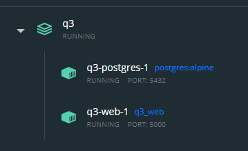
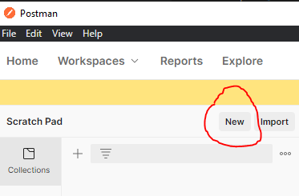
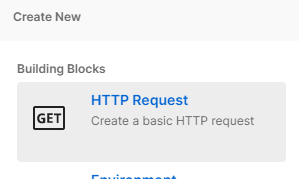
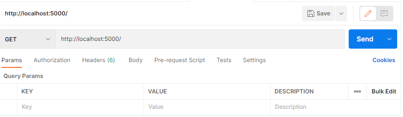
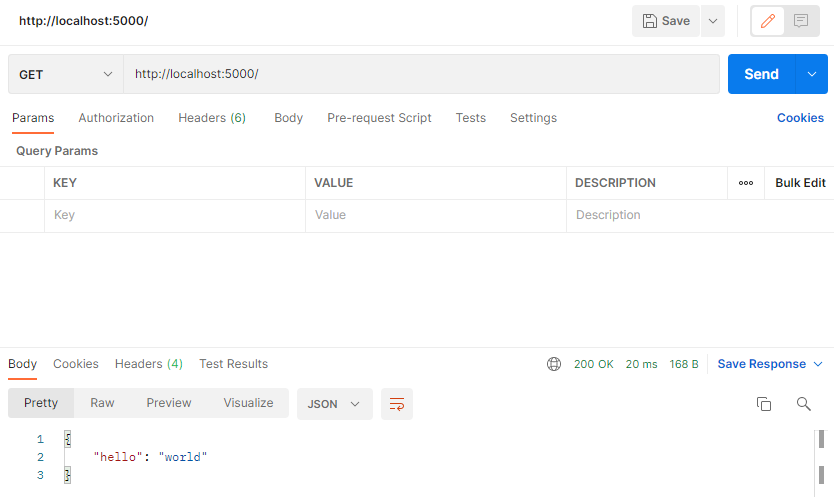
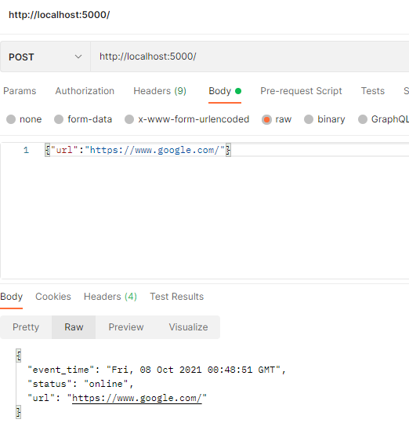
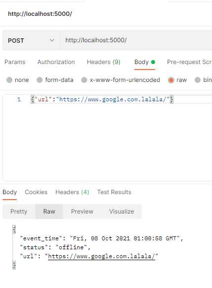
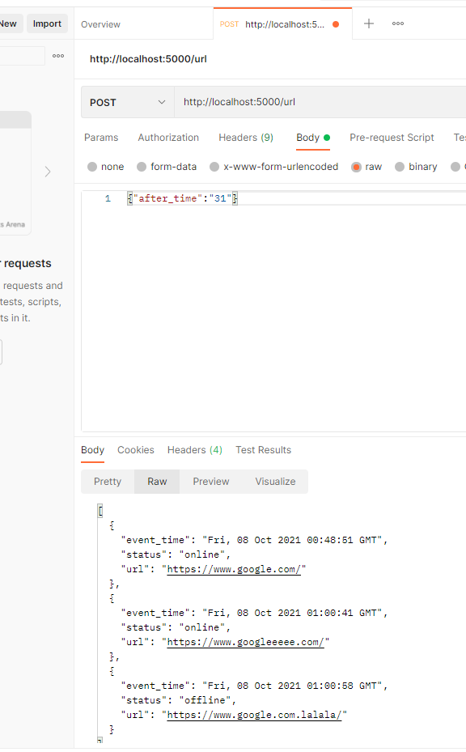

# Backend - Q3

# Questão

Esta questão possui múltiplos objetivos. Leia todos para planejar sua rota de trabalho.

Para cumprir os próximos, finalize este antes:

- Crie um container com uma API simples usando Flask ou FastAPI e adicione uma rota para receber requisições GET e responder com JSON. A API deverá ser acessível a partir do host (1 pt).

Após cumprir o primeiro item:

- Adicione uma rota para receber requisições POST com um endereço URL no corpo. Faça a requisição à URL e crie um log informando a data e hora da requisição, o link recebido e o estado da URL (online ou offline) (1 pt).
- Valide os dados recebidos e enviados pela API com dataclasses, Pydantic ou equivalente (1 pt).
- Crie um segundo container com um banco de dados da sua preferência e armazene os eventos POST (1pt).
  - Adicione uma rota que permita coletar os eventos POST armazenados no DB a partir da data do evento (1 pt).

Extra:

- Crie uma network para a API e um novo container para atuar como "ponte". O host deverá apenas (E SOMENTE) conseguir se comunicar com a ponte e nunca com a API diretamente (1 pt).

Deixe todos os arquivos do projeto neste diretório.

# Reposta

<h2> Passo 1 </h2>
Pelo terminal, vá até o diretório do projeto e digite o comando:

powershell
```
docker-compose up --build
```

Após finalizado o comando o leitor deverá ver o seguinte resultado no docker:




<h2> Passo 2 </h2>

Para a mais fácil visualização/teste do resultado utilizo o software `Postman` que pode ser baixado [aqui](https://www.postman.com/downloads/).

Após instalado, siga os seguintes passos para o teste da aplicação:

1 - Clique em new:



2 - Clique em HTTP Request:



3- No campo de preenchimento coloque a informação do endereço em que a aplicação está rodando:



<h2> Respostas </h2>

- Crie um container com uma API simples usando Flask ou FastAPI e adicione uma rota para receber requisições GET e responder com JSON. A API deverá ser acessível a partir do host (1 pt).




- Adicione uma rota para receber requisições POST com um endereço URL no corpo. Faça a requisição à URL e crie um log informando a data e hora da requisição, o link recebido e o estado da URL (online ou offline) (1 pt).

O leitor deverá no postman, mudar para o POST e como foi pedido a requisição-body, no postman o leitor deverá fazer os seguintes passos: params->text->raw->json

Como exemplo, temos o resultado gerado:




Caso não exista o endereço, ou o endereço estando fora do ar, temos o seguinte exemplo:





- Valide os dados recebidos e enviados pela API com dataclasses, Pydantic ou equivalente (1 pt).
- Crie um segundo container com um banco de dados da sua preferência e armazene os eventos POST (1pt).
  - Adicione uma rota que permita coletar os eventos POST armazenados no DB a partir da data do evento (1 pt).

Abaixo, fizemos uma request para a apliação no qual passamos um dia, e a aplicação volta todas requições posteriores a data.



<h1> FIM DA QUESTÃO </h1>