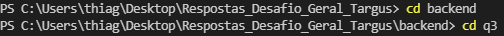
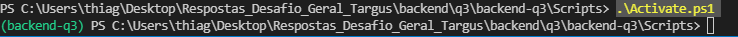

# Resposta Backend - Q3

Bem vindo leitor. Neste documento você terá acesso a toda documentação e o passo a passo para realização dessa questão.

# Tabela de conteúdo - Geral

1. [ Questão pedida. ](#desc)
2. [ Solução. ](#usage)

---

<a name="desc"></a>
<h2> Backend - Q3 </h2>

Esta questão possui múltiplos objetivos. Leia todos para planejar sua rota de trabalho.

Para cumprir os próximos, finalize este antes:

- Crie um container com uma API simples usando Flask ou FastAPI e adicione uma rota para receber requisições GET e responder com JSON. A API deverá ser acessível a partir do host (1 pt).

Após cumprir o primeiro item:

- Adicione uma rota para receber requisições POST com um endereço URL no corpo. Faça a requisição à URL e crie um log informando a data e hora da requisição, o link recebido e o estado da URL (online ou offline) (1 pt).
- Valide os dados recebidos e enviados pela API com dataclasses, Pydantic ou equivalente (1 pt).
- Crie um segundo container com um banco de dados da sua preferência e armazene os eventos POST (1pt).
  - Adicione uma rota que permita coletar os eventos POST armazenados no DB a partir da data do evento (1 pt).

Extra:

- Crie uma network para a API e um novo container para atuar como "ponte". O host deverá apenas (E SOMENTE) conseguir se comunicar com a ponte e nunca com a API diretamente (1 pt).

Deixe todos os arquivos do projeto neste diretório.

---

<a name="usage"></a>
<h2>Solução</h2>

<h3> Tabela de Solução</h3>

1. [ Criação de um ambiente local para o desenvolvimento (Opcional). ](#1)
2. [ Instalação dos arquivos necessários. ](#2)
3. [ Debug. ](#3)
3. [ Solução Final do Debug. ](#4)


<a name="1"></a>
<h3> 1- Criação de um ambiente local para o desenvolvimento (Opcional) </h3>

É recomendável a criação de um ambiente local para o desenvolvimento, pois neste ambiente terá apenas as bibliotecas utilizadas na aplicação.

ATENÇÃO: Esse passo está sendo mostrado no intuido de trazer ao leitor todos os passos do desenvolvimento. Fica a cargo do programador faze-lo ou não

<h4>1.1 - Criação do ambiente local utilizando "venv" e seus comandos </h4>

Com o python instalado, utilazando o powershell(windows) vamos até a pasta criada para o projeto , utilizando o comando `cd`. Abaixo o print dos comandos:



Após isso, digitamos o comando:

```powershell
python -m venv nome-ambiente
```

Pronto, o ambiente foi criado.

Para ativar esse ambiente basta, ir pelo comando `cd` na pasta do ambiente. Após isso, ir na pasta Scripts  rodar o seguinte comando.

```powershell
 .\Activate.ps1
```
Abaixo, a imagem do ambiente rodando localmente:



<a name="2"></a>
<h3> 2- Instalação dos arquivos necessários.</h3>

Vamos instalar as seguintes bibliotecas, rodando os comando abaixo:

```powershell
pip install fastapi
```

```powershell
pip install uvicorn
```

